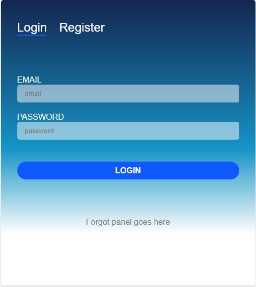
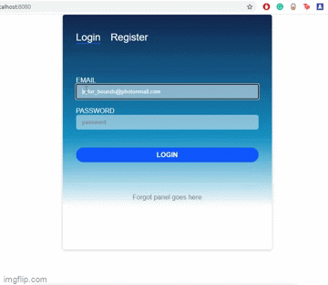
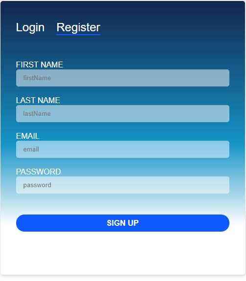
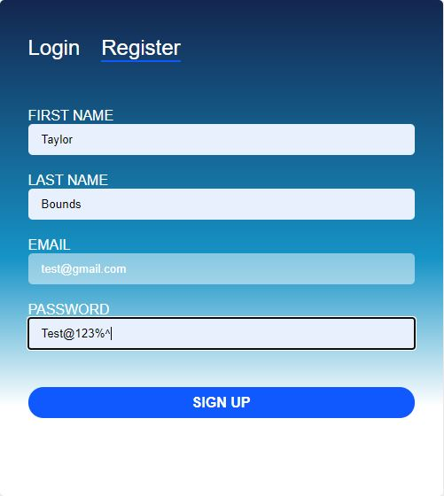
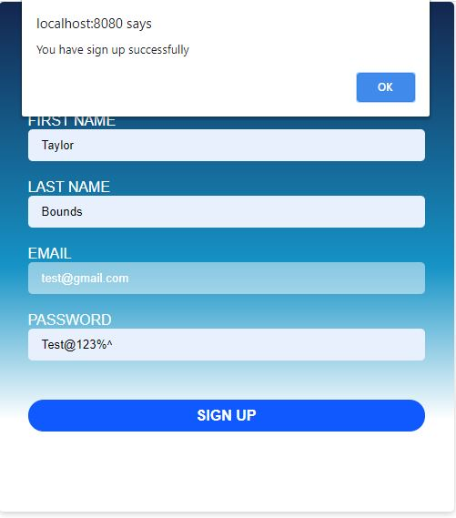
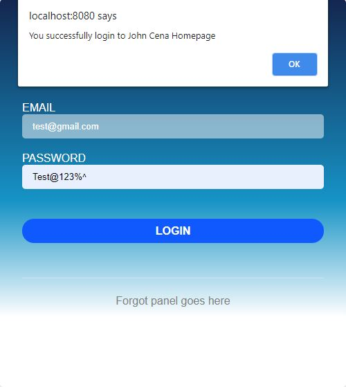

# CodingChallengeWebApplication


---

## Description
Created a simple web application to handle user registration and login feature using several different technologies stack for front-end(reactJs) and back-end development(nodeJs, mongoDB and express)

This project used the following technologies
- React and React-spring for front-end development
- NodeJs and Express for the back-end development
- MongoDB for the database

Business Requirement
- We want to create a simple nodeJS web application.
- We will need a database. You can use mongoDB or any other database. If you want to
use MongoDB, you can use https://mlab.com/
- This will be a simple login/register application where an user can register himself (using
say first-name, last-name, email, password). Once registered, the user can then login to
the system with his email and password.
- The code must be production ready. This means.
o Check all edge cases (check format of email, add some requirement on
password. Use your imagination!).
o Handle duplicate email
o No need to perform 2 factor authentication or reset password.
- For front-end development, you can use any language. It can be a simple HTML page or
any front-end framework (such as reactJS).
- Code must be uploaded to a code repository. I suggest use bitbucket or github. You can
share the link with use to review.
- Must provide detail instruction on how to run the code. A readme file will work.

## Prerequisites

These are the following technologies that you should already have install on your machine before running the app.
- Node.js  https://nodejs.org/en/download/
- NPM      https://www.npmjs.com/get-npm
- React    https://react-cn.github.io/react/downloads.html
- MongoDB Atlas https://www.mongodb.com/cloud/atlas/lp/try2?utm_source=google&utm_campaign=gs_americas_united_states_search_core_brand_atlas_desktop&utm_term=mongo%20atlas&utm_medium=cpc_paid_search&utm_ad=e&utm_ad_campaign_id=12212624338&gclid=CjwKCAiAyc2BBhAaEiwA44-wW8qW2op46O3QB-ga7wIPTgfUd-qUqHa3-UZ6-lMPL3t7LKPc8K75mxoCxMAQAvD_BwE

#### FOLDER STRUCTURE 

```
CodingChallengeWebApplication
    dist/
                index.html
                main.js
    models/
                Users.js
    node_models/
    public/
    routes/
                login.js
                signup.js
    src/
            components/
                Login/
                    LoginPage.js
                    LoginServices.js
                Register/   
                    RegisterPage.js
                    RegisterServices.js 
            App.js
            stylesheet.css
        index.html
        index.js
    .babelrc
    .dockerignore
    .gitignore
    config.json
    Dockerfile
    index.js
    package-lock.json
    package.json
    webpack.config.js
```
`CodingChallengeWebApplication/index.js`contains most of back-end functionalities of the application including running mongoDB. 

Here's the index.js
````
const express = require('express');
const path = require('path');
var cors = require('cors');
var config = require('./config.json');
const app = express();
const bodyParser = require("body-parser");
const mongoose = require('mongoose');

//This prevent anyone from being block by CORS policy when accassing the database
app.use(cors());

app.set("port", process.env.PORT || config.mongodb.port);

app.use(express.static(path.join(__dirname, 'public')));

//Setting the connection to MongoDB
mongoose.connect(config.mongoConnectionString, {
        useUnifiedTopology: true,
        useNewUrlParser: true
    });

//Return error if mongoDB fails to connect
mongoose.connection.on('error', (err)=>{
    console.log("Error: " + err)
})

//Testing the connection
mongoose.connection.once('open',()=>{
   console.log("The conection to mongoDB is working")
})

/**
 * Router Middleware
 * Router - /user/*
 * Method - *
 */
app.use(bodyParser.json());
app.use("/user", require('./routes/signup'));
app.use("/user", require('./routes/login'))

//Testing port connection
var server = app.listen(app.get("port"), () => {
    console.log('Express server listening on port ' + server.address().port)
})
````
`src/components` containing most of the files for running the client-side


#### Installation
Clone the repository

```
 https://github.com/blackprogrammer234/CodingChallengeWebApplication.git
```
Run the index.js to start the server 

```
 node index.js
```
Note: Run `npm install cors --save` from the command line if you get following command: Cannot find module 'cors'

Install the packages to start running the client side

```
 npm install
```

Run the client 

```
 npm start
```
The application should be running at http://localhost:3000/


#### Running the app




Create a new account

Navigate to the registration page by clicking the "register" button.

Note:

The application will throw 400 (bad request) if the user is trying to register with an existing account.

When creating a password make sure that it contain the following below. If not the application will not allow the user to register a new account
- least 6 character long 
- contain one uppercase letter
- contain one lowercase letter
- conatin one number





Here are the validation checks that are executing before making a call to the registration API
```
 //Check to see if the first name field contains only letter and not empty
        if(!this.state.firstName || this.state.firstName.match(/\d/)){
            firstNameError = configData.FirstName_Error_Message;
        }
        //Check to see if the last name field contains only letter, no dupicate names and not empty
        if(!this.state.lastName || this.state.lastName == this.state.firstName || this.state.lastName.match(/\d/)){
            lastNameError = configData.LastName_Error_Message;
        }
        //Check to see if the email is a valid email and not empty
        if(!validator.isEmail(this.state.email) || !this.state.email){
            emailError = configData.Email_Error_Message;
        }
        //Check to see if the password meet the following requirement
        //Password must be least 6 character long
        //Password must contain least one uppercase letter, one lowercase letter, one number and one special character
        if(!validator.isStrongPassword(this.state.password, 
            {minLength: 6, minLowercase: 1, 
            minUppercase: 1, minNumbers: 1, minSymbols: 1
        })){
            passwordError = configData.Password_Error_Message;}

```

Here's the API call being made when the user is being registered

```
const RegisterService = data => (
	axios.post(baseUrl+ "/user/signup", data)
		.then(res => res.status)
        .catch((error) =>{
            console.log(error.res);
        })
)
```

The application will return a success message when the user is completed creating a new account. In which at that point the user can navigate to the login page



When logging into the application, the user will need to input the same credential they use to register to successfully login

Here are the validation checks that are executing before making a call to the Login API
```
//Check to see if the password field is not empty
        if(!this.state.password){
            passwordError = configData.Password_Error_Message;
        }
        //Check to see if the email is a valid email and not empty
        if(!validator.isEmail(this.state.email)){
            emailError = configData.Email_Error_Message;
        }
```

Here's the API call being made when the user is being authenticated
```
const LoginService = data => (
	axios.post(baseUrl+ "/user/login", data)
		.then(res => res.status)
        .catch((error) =>{
            console.log(error.res);
        })
)
```
Here's the implementation that's being executed if the user fails to be authenticated

```
//Display error mesage if error is set to true
        if(error){
            alert(configData.Failure_Message_For_Login);
            this.setState({error: false})
        }
```

Here's the implementation that's being executed after the user has been successfully authenticated

```
  //Display success message if loginSuccess is set to true
        if (loginSuccess) {
           alert(configData.Success_Message_For_Login);
           this.setState(initialState);
	   //This will open up a new window in your browser and play a quick John Cena video. Enjoy!!!:)
           window.open(configData.Home);
        }
```


---

## References
[Back To The Top](#read-me-template)

---

## License

MIT License

Copyright (c) [2017] [James Q Quick]

Permission is hereby granted, free of charge, to any person obtaining a copy
of this software and associated documentation files (the "Software"), to deal
in the Software without restriction, including without limitation the rights
to use, copy, modify, merge, publish, distribute, sublicense, and/or sell
copies of the Software, and to permit persons to whom the Software is
furnished to do so, subject to the following conditions:

The above copyright notice and this permission notice shall be included in all
copies or substantial portions of the Software.

THE SOFTWARE IS PROVIDED "AS IS", WITHOUT WARRANTY OF ANY KIND, EXPRESS OR
IMPLIED, INCLUDING BUT NOT LIMITED TO THE WARRANTIES OF MERCHANTABILITY,
FITNESS FOR A PARTICULAR PURPOSE AND NONINFRINGEMENT. IN NO EVENT SHALL THE
AUTHORS OR COPYRIGHT HOLDERS BE LIABLE FOR ANY CLAIM, DAMAGES OR OTHER
LIABILITY, WHETHER IN AN ACTION OF CONTRACT, TORT OR OTHERWISE, ARISING FROM,
OUT OF OR IN CONNECTION WITH THE SOFTWARE OR THE USE OR OTHER DEALINGS IN THE
SOFTWARE.

[Back To The Top](#read-me-template)

---

## Author Info
- LinkedIn - https://www.linkedin.com/in/taylor-bounds-1b7b36aa/

